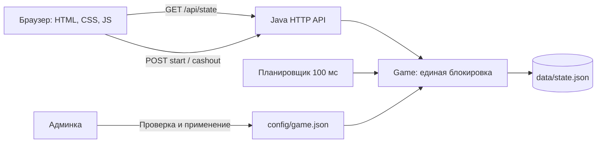

# Архитектура

## Компоненты

Один процесс Java 21 обслуживает HTTP API и статические файлы. Внешних библиотек у сервера нет. Стандартный `HttpServer` запускает обработчики в виртуальных потоках. Планировщик выполняет `tick` каждые 100 мс. Клиент после завершения каждого запроса состояния ждёт 250 мс перед следующим запросом. Одновременно два фоновых poll-запроса не выполняются. При исправной локальной сети обновления укладываются в ограничение одной секунды.

- `src/balloon/Server.java`: маршруты, cookie, CSRF, административный доступ, ограничение тела запроса, статика.
- `src/balloon/Game.java`: авторитетная игровая модель, случайность, баланс, очки, награды, хеши, состояние.
- `src/balloon/Config.java`: проверка всех групп параметров и расчёт границ уровней.
- `src/balloon/Json.java`: небольшой JSON-кодек без зависимостей с ограничением вложенности, запретом повторных ключей и нечисловых значений.
- `web/app.js`: пользовательские действия, показ серверных значений, анимация и модальные окна.
- `web/admin.js`: редактирование и применение конфигурации.
- `web/presentation.*`: автономная браузерная презентация.

## Состояние

Пилот: случайный идентификатор, отображаемое имя, баланс в целых сотых бонуса, общие игровые очки, массив количеств шести марок, число альбомов, текущий/последний раунд, время демопополнения.

Раунд: UUID, владелец, ключ идемпотентности, тема, ставка и бустер, полный снимок конфигурации, время начала, скрытая точка краха, позиция бустера, полученные очки, последний пройденный уровень, факт cashout и выплата, награда, хеш обязательства и секретная строка проверки.

`data/state.json` содержит пилотов и все раунды. API истории возвращает последние 40 завершённых раундов по времени завершения. Активные раунды в публичную историю не попадают. Полная таблица очков содержит реальных пилотов текущего хранилища без искусственных ботов.

Баланс не равен очкам: из баланса списываются ставки, на него зачисляются выплаты и альбомные бонусы. Очки только растут и задают положение в таблице. Марки хранятся отдельно.

## Конкурентность и сохранение

Публичные операции сервиса синхронизированы на одной блокировке. Перед cashout сервис обновляет раунд до текущего серверного времени, поэтому поздний запрос не может обойти уже наступивший крах. Клиент передаёт только UUID раунда. Дополнительные поля вроде `multiplier`, `amount` или `points` API отклоняет.

Повторный `start` с тем же `requestId` возвращает первоначальный раунд без нового списания. Разные ключи не позволяют открыть второй активный раунд того же пилота. Повторный cashout возвращает первоначальную выплату, даже если раунд уже завершился. Начисления уровней опираются на `highestLine`, а завершённые раунды не проходят повторную выдачу награды.

После изменения денежного состояния, очков или наград сервис записывает полный снимок во временный файл рядом с целевым и атомарно заменяет `state.json`. При перезапуске загружает снимок и доводит активные раунды до текущего времени. Неизменяемые `startedAt`, точка краха и конфигурация сохраняют исход заранее выбранного полёта.

Ограничения: полная перезапись JSON и одна блокировка рассчитаны на MVP. Нет журнала транзакций, `fsync`-гарантии при отключении питания и координации между процессами. При ошибке записи на диск операция может сохраниться только в памяти; промышленное решение требует транзакционной СУБД. Нельзя одновременно направлять два процесса на один каталог данных.

## API

Все тела POST имеют `Content-Type: application/json`. После `GET /api/state` клиент получает CSRF-токен и передаёт его в заголовке `X-CSRF-Token`. Идентификатор сессии находится только в cookie. В публичном состоянии идентификаторы пилотов заменены сокращённым хешем.

| Метод и путь | Тело / результат |
| --- | --- |
| `GET /health` | `{status: "ok"}` |
| `GET /api/state` | Пилот, текущий/последний раунд, конфигурация, история, таблица, время сервера, CSRF |
| `POST /api/rounds` | `{theme: "green" или "red", tier: 0..3, requestId: UUID}` |
| `POST /api/rounds/{id}/cashout` | `{}`; серверная фиксированная выплата |
| `GET /api/rounds/{id}/proof` | Хеш и исходная строка только завершённого раунда |
| `POST /api/profile` | `{name: "Пилот"}`, 1–24 символа |
| `POST /api/topup` | `{}`, демонстрационное пополнение |
| `POST /api/new-session` | `{}`, новая демосессия; в интерфейсе основной игры отдельной кнопки нет |
| `POST /api/admin/login` | `{password: "..."}` |
| `GET /api/admin/config` | Проверенная конфигурация, версия и ошибка внешнего файла, если есть |
| `POST /api/admin/config` | Полный объект конфигурации |
| `POST /api/admin/scenario` | `{scenario: "random", "cashout", "crash" или "booster"}`, только DEV |
| `POST /api/admin/logout` | `{}` |

Ошибки имеют JSON-поле `error`. Некорректные игровые действия возвращают 400, отсутствие административного доступа 401, CSRF/Origin 403, неизвестный адрес 404, неподдерживаемый метод 405, превышение лимита попыток пароля 429.

## Граница доверия

Сервер генерирует и считает всё, что влияет на результат. Клиентские часы, выбранная анимация или подмена JavaScript не могут изменить баланс. Сумма на кнопке cashout тоже приходит с сервера, но фактическая выплата фиксируется по серверному времени обработки запроса, а не по последнему кадру клиента.

Проверяются CSRF, `Origin` и `Sec-Fetch-Site`; сторонние CORS-запросы не разрешены. Cookie `HttpOnly` и `SameSite=Strict`. CSP запрещает внешние скрипты и встраивание страницы во frame. Статика ограничена каталогом `web` с проверкой нормализованного пути и симлинков. Системные ошибки не раскрывают клиенту stack trace. Имя пилота экранируется при вставке в HTML.

Админка прототипа использует общий демонстрационный пароль. Лимит пяти попыток в минуту действует на сессию, а не на IP и не является защитой промышленной авторизации. До публичного запуска нужны отдельные учётные записи, HTTPS, cookie `Secure`, срок действия административной сессии, глобальные ограничения запросов и аудит.
